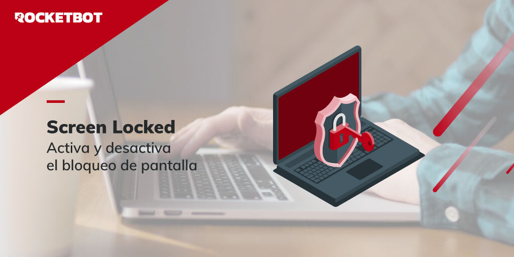

# Pantalla Bloqueada
  
Control de Bloqueo de Pantalla en Windows  

*Read this in other languages: [English](Manual_screenLocked.md), [Español](Manual_screenLocked.es.md).*
  

## Como instalar este módulo
  
__Descarga__ e __instala__ el contenido en la carpeta 'modules' en la ruta de Rocketbot.  

## Descripción de los comandos

### Pantalla bloqueada
  
Guardar valor de la pantalla bloqueada
|Parámetros|Descripción|ejemplo|
| --- | --- | --- |
|Asignar resultado a variable|Variable donde se guardará el resultado|Variable|
  

### Deshabilitar Bloqueo de Pantalla
  
Evita que la pantalla se bloquee
|Parámetros|Descripción|ejemplo|
| --- | --- | --- |
| --- | --- | --- |

### Habilitar Bloqueo de Pantalla
  
Evita que la pantalla se bloquee
|Parámetros|Descripción|ejemplo|
| --- | --- | --- |
| --- | --- | --- |